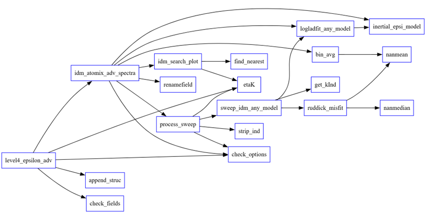

# level4_adv_atomix
Estimating turbulent kinetic energy epsilon from point-velocity spatial spectra

Code provided "as-is" to estimate epsilon from level 3 spectra in the SCOR 160 working group's NetCDF format. The main calling function is level4_epsilon_adv. 
This toolbox includes spectral fitting, bootstrapping, and finding theinertial subrange. 

